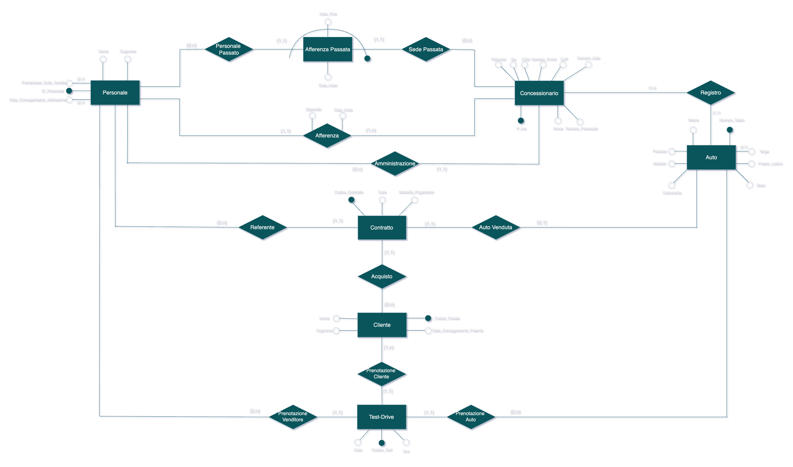

# Dealership Management System
> **Note:** The actual code and testing are done in italian, since the project was made to be evaluated in the "Databases and informative systems" course, which take place in italian.
## System Functionality
This project involves the design and implementation of a robust database for a **Tuscan Dealership Chain**. The system is designed to manage high-volume data related to sales, vehicle inventory, and multi-location staffing.

**Key Features:**
*   **Inventory Management:** Tracks both new and used vehicles, including technical specs like horsepower (CV), fuel type, and price.
*   **Staff Hierarchy:** Distinguishes between **Salespeople** (performance-based commissions) and **Directors** (branch management with 10-year certifications).
*   **Sales & Contracts:** An automated system for recording contracts linking vehicles, customers, and employees.
*   **Test Drives:** A booking system with safety logic to prevent novice drivers from testing high-powered vehicles (> 95 CV).

## Design & Logic
To ensure data integrity and system efficiency, the following logic was applied:
*   **Reification:** Complex relationships (Test Drives and Contracts) were transformed into independent entities to allow for multiple interactions between the same customer and vehicle.
*   **Redundancy Optimization:** Added derived attributes to the "Dealership" entity (e.g., `Revenue`, `Car_Count`) to speed up frequent analytical queries.
*   **Relational Mapping:** Conversion from a conceptual E-R model to a normalized relational schema.

---

## E-R Model
The system architecture was designed following standard Entity-Relationship conventions to ensure clear data flow.
> **Note:** The diagram illustrates the 1:N and N:M relationships between branches, employees, and stock. Key entities like **Contract** act as the central hub for sales operations.

---

## Implementation Details

### Automated Business Logic (Triggers)
The database utilizes **MySQL Triggers** to enforce business rules that cannot be captured by simple table constraints:
*   **Safety Constraints:** Automatically blocks test drive entries if the customer has held their license for less than 3 years and the car exceeds 95 CV.
*   **Certification Monitoring:** Prevents a Director from being assigned if their professional certification is over 10 years old.
*   **Real-time Statistics:** Triggers update the `Revenue` and inventory counts automatically whenever a sale is finalized.

### Performance Engineering
To handle a scale of **10,000+ vehicles** and **25,000+ customers**, we implemented:
*   **Strategic Redundancy:** Storing the total number of staff and cars in the Dealership table reduces expensive `COUNT` operations during high-traffic reads.
*   **Integrity Checks:** Triggers ensure an employee cannot hold conflicting roles (e.g., Director and Salesperson) simultaneously.

### Procedures & Functions
To simplify complex operations, the system includes:
*   **SpostaAuto:** Handles the logistical transfer of vehicles between different dealership locations.
*   **VendiAuto:** Registers a sale, updates the car status to "Sold," and recalculates dealership revenue in one transaction.

---

## Testing & Quality Assurance
The database logic was verified through workload simulations and edge-case testing:
*   **Integrity Testing:** Verified that deleted personnel records correctly update "Past Affiliation" logs.
*   **Stress Testing:** Analyzed query response times for "Cars in Budget" searches across a large simulated dataset.
*   **Constraint Verification:** Confirmed that horsepower/license-age triggers effectively block unsafe test drive operations.

---

## Technical Stack
*   **Database Engine:** MySQL[cite: 1]
*   **Design Tools:** yED Live / E-R Modeling software[cite: 1]
*   **Documentation:** Markdown / GitHub[cite: 1]
